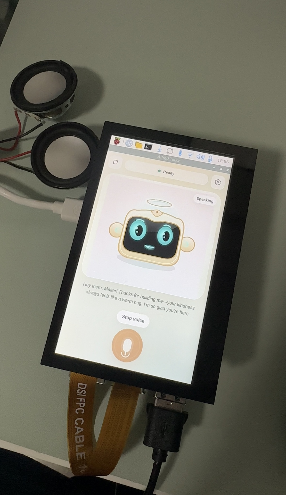
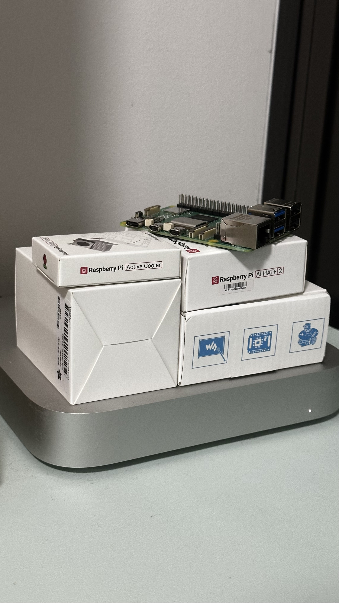
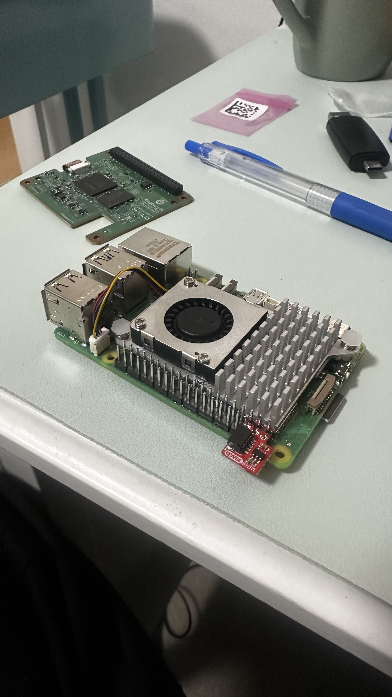

# Alfred Local Pi LLM

<p align="center">
  
</p>

Alfred is an offline, touch-first AI companion built for a Raspberry Pi 5 with a Hailo AI HAT+ 2. The goal is simple: make a small local device that can listen, think, and speak without depending on a cloud LLM.

The project combines a local touchscreen web app, speech-to-text, a Hailo/Ollama-compatible model server, streaming replies, text-to-speech, health checks, and an evaluation loop for measuring answer quality and speed on real Pi hardware.

## Project Scope

Alfred is focused on a practical local AI appliance:

- Run a local chat model on Raspberry Pi hardware.
- Capture voice from the browser and transcribe it locally.
- Stream model responses back into the UI as they arrive.
- Speak replies aloud with local text-to-speech.
- Keep the UI simple enough for a small touchscreen.
- Measure latency, answer quality, routing, and failure cases with repeatable evals.
- Favor offline/private operation over cloud convenience.

This repository is the active source of truth for the Alfred touchscreen build.

## Current Status

Alfred currently supports:

- FastAPI backend for the local touch app.
- Browser-based touch UI with chat, voice, health, and settings flows.
- Local speech-to-text through `whisper.cpp`.
- Local text-to-speech through Piper.
- Hailo/Ollama-compatible chat backend.
- Streaming voice replies with sentence-level TTS playback.
- Route-aware prompting for factual, reflective, social, audience, follow-up, malformed, and current-info requests.
- Guardrails for live/current facts that cannot be verified offline.
- Rolling memory with tighter boundaries so stale context does not leak into every answer.
- Hardware and software health checks for the Pi, display, touch input, audio, Hailo device, and model server.
- Repeatable eval reports with Markdown summaries and JSONL traces.

The project is still in active tuning. The biggest open area is balancing speed, answer depth, and personality on a small local model.

## Hardware Stack

<p align="center">
  
</p>

Validated target hardware:

- Raspberry Pi 5
- Raspberry Pi OS 64-bit
- Hailo AI HAT+ 2 / Hailo AI accelerator
- Touchscreen display
- USB microphone
- Local speaker output

Other setups may work, but audio device IDs, display configuration, and model server details may need environment overrides.

<p align="center">
  
</p>

## Software Stack

- `FastAPI` and `uvicorn` for the local backend
- Browser UI for touch interaction
- `whisper.cpp` for local STT
- Piper for local TTS
- Hailo/Ollama-compatible chat endpoint for local model inference
- Python runtime modules under `alfred/`
- Shell setup, launcher, bootstrap, and healthcheck scripts for Pi deployment

## Repository Layout

```text
alfred-local-pi-llm/
├── alfred/                         # Shared chat, memory, config, prompt, and audio runtime
├── alfred_touch.py                 # Uvicorn compatibility entrypoint
├── alfred_touch_app/               # FastAPI touch app, UI assets, streaming, and TTS service
├── docs/                           # Eval process, validation notes, and project handoff docs
├── scripts/
│   ├── alfred_touch_env.sh         # Shared runtime defaults
│   ├── bootstrap_alfred_touch.sh   # Startup preflight and self-repair
│   ├── eval_alfred_model.py        # Model quality and latency benchmark loop
│   └── setup_alfred_audio.sh       # Local speech asset setup
├── healthcheck_alfred_touch.sh     # Pi hardware/audio/Hailo checks
├── healthcheck_alfred_software.sh  # Backend and HTTP smoke checks
├── install_alfred_touch_launcher.sh
├── launch_alfred_touch.sh
├── setup_alfred_touch.sh
├── start_alfred_touch.sh
└── requirements.txt
```

Large generated/runtime assets are intentionally not part of Git. Local directories such as `piper/`, `models/`, `whisper.cpp/`, `.alfred-audio/`, and `.alfred-state/` are created or populated during setup and runtime.

## Setup On The Pi

```bash
git clone <your-repo-url> alfred-local-pi-llm
cd alfred-local-pi-llm
chmod +x *.sh scripts/*.sh
./setup_alfred_touch.sh
```

The setup flow:

- Installs required system packages.
- Creates or reuses a Python virtual environment.
- Installs Python dependencies.
- Prepares local speech dependencies.
- Installs the Alfred desktop launcher.

## Run Alfred

Start the backend directly:

```bash
./start_alfred_touch.sh
```

Or use the launcher flow:

```bash
./launch_alfred_touch.sh
```

To reinstall the desktop launcher:

```bash
./install_alfred_touch_launcher.sh
```

## Validate The Device

Hardware, display, touch, audio, Hailo, and model-server checks:

```bash
./healthcheck_alfred_touch.sh --audio-test
```

Backend and HTTP smoke checks with the mock backend:

```bash
./healthcheck_alfred_software.sh --mock-only
```

Live local-model smoke checks:

```bash
./healthcheck_alfred_software.sh --live
```

## Eval And Benchmark Loop

Alfred includes a repeatable eval harness so tuning is not based on vibes.

Run the core validation suite:

```bash
./scripts/eval_alfred_model.py --backend live --suite validation --warmup 1 --label pi-baseline
```

Each run writes:

- A Markdown report for quick reading.
- A JSONL trace for per-prompt inspection.
- Runtime metadata including model, temperature, context size, token budgets, and backend timings.

Reports are saved under:

```text
.alfred-state/evals/
```

See `docs/alfred-eval-benchmark.md` for the eval fields, suites, and tuning workflow.

## Runtime Configuration

The shared defaults live in:

```text
scripts/alfred_touch_env.sh
```

Common overrides:

```bash
ALFRED_LLM_URL=http://127.0.0.1:8000/api/chat
ALFRED_LLM_MODEL=qwen3:1.7b
ALFRED_LLM_TEMPERATURE=0.35
ALFRED_LLM_NUM_CTX=2048
ALFRED_ARECORD_DEVICE=plughw:3,0
ALFRED_APLAY_DEVICE=plughw:2,0
ALFRED_WHISPER_MODE=fast
```

If your microphone, speakers, or model server differ from the validated Pi setup, override environment variables rather than editing application code.

## Bootstrap Behavior

Before Alfred launches, the bootstrap step attempts to make the local runtime healthy:

- Checks required Python imports.
- Repairs or rebuilds `whisper.cpp` if the binary is broken after a repo move.
- Restores missing local speech runtime assets.
- Starts a local model server when configured for localhost and the server is offline.
- Verifies that the configured model is visible through the local model endpoint.

The goal is that tapping the Alfred launcher on the Pi should be enough for normal use.

## Engineering Notes

Alfred is being developed like a real product prototype:

- Hardware health checks are scripted.
- Software smoke tests are scripted.
- Model behavior is benchmarked with repeatable suites.
- Eval reports capture both speed and answer-shape failures.
- Prompt routing is separated from model generation so changes can be measured.
- Runtime state is kept out of Git.
- Setup and launch scripts are designed to be repeatable on the Pi.

## Known Limits

- Small local models are fast enough for a demo, but they need careful routing and prompt shaping.
- The current model is Qwen3 1.7B, a tiny instruction-tuned model better suited to simple kiosk-style interactions than a full companion AI. This project pushes it to the limits.
- Alfred cannot verify live facts such as weather, current prices, breaking news, stock availability, or current leaders unless a live tool is added.
- Voice quality depends on the microphone, speaker, and local audio device mapping.
- Some answer-quality tuning is still ongoing, especially for social responses.

## Roadmap

Near-term work:

- Continue improving responses without hardcoding benchmark answers.
- Add more blind eval prompt sets to avoid overfitting to known prompts.
- Improve transcript inspection so real voice failures can be compared against typed evals.
- Make audio device selection easier from the UI.
- Package the launcher/runtime flow more cleanly for repeatable installs.
Test stronger models once the Hailo Model Zoo expands its support for Hailo-optimized LLMs.

## License
MIT. See `LICENSE`.
